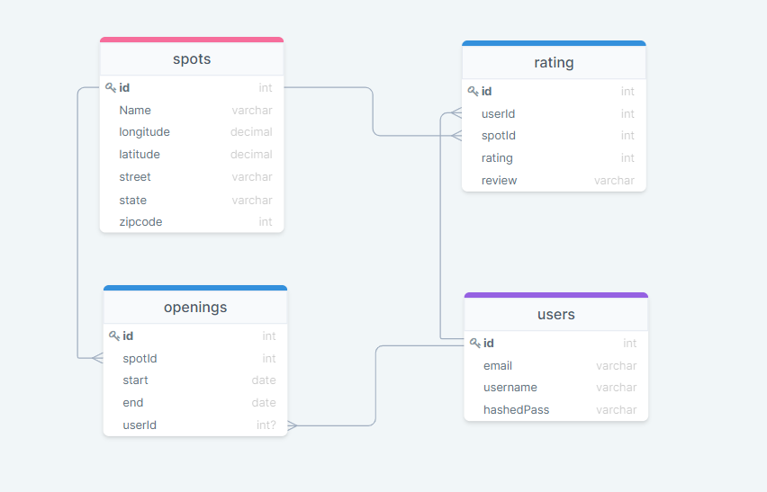

<!-- PROJECT LOGO -->
 

  
  

  
  [![LinkedIn][linkedin-shield]][linkedin-url]

 <h3 align="center">SkinTnT</h3>

<!-- TABLE OF CONTENTS -->

  
Table of Contents

  <ol>
    <li>
      <a href="#about-the-project">About The Project</a>
      <ul>
        <li><a href="#built-with">Built With</a></li>
      </ul>
      <ul>
        <li><a href="#database-schema">Database Schema</a></li>
      </ul>
    </li>
    <li><a href="#features">Features</a></li>
    <li><a href="#live-link">Live Link</a></li>
    <li><a href="#contact">Contact</a></li>
  </ol>

<!-- ABOUT THE PROJECT -->
## About This Project
SkintTnT is a clone of [AirBnB](https://www.airbnb.com/s/homes?location_search=NEARBY&search_type=HOMEPAGE_BANNER) to help those in need of ink find a place near them to satisfy their needs in providing a tattoo spot with reviews and location. It will users to search tattoo shops by location or name, allow them to book sessions as well as leave reviews for future users to see.

### Built With
* [React](https://reactjs.org/docs/getting-started.html)
* [Redux](https://react-redux.js.org/)
* [Express](https://expressjs.com/)
* [Sequelize](https://sequelize.org/)

### Database Schema

---

### Features
* Login/Demo Login
  * A function integrated into our homepage that allows the user to login through our login modal, to not disrupt their current experience

* Bookings
  * Users can book a session with at their favorite tattoo shops
 

* Cancel Bookings
  * Users can cancel there own booked sessions
 

* Ratings/Reviews
  * Users can leave a rating and review on a shop

---

### Live Link
* [SkinTnT](https://skintnt.herokuapp.com/)

---

### Contact
- Ramses Romero - ramses.romero.jr@gmail.com
- [linkedIn]()
- [Project Link]()

[linkedin-shield]: https://img.shields.io/badge/-LinkedIn-black.svg?style=for-the-badge&logo=linkedin&colorB=555
[linkedin-url]: https://www.linkedin.com/in/ramses-romero-jr/
